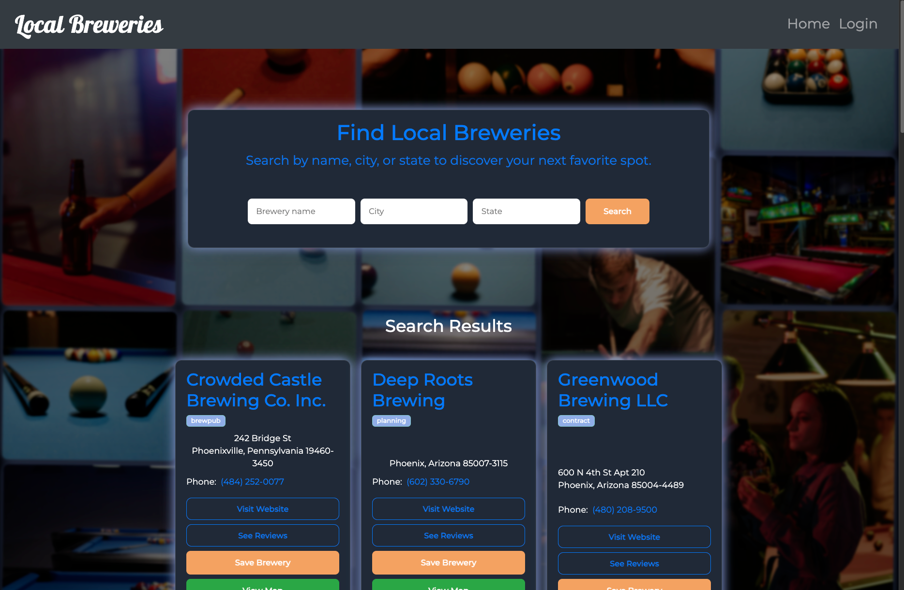
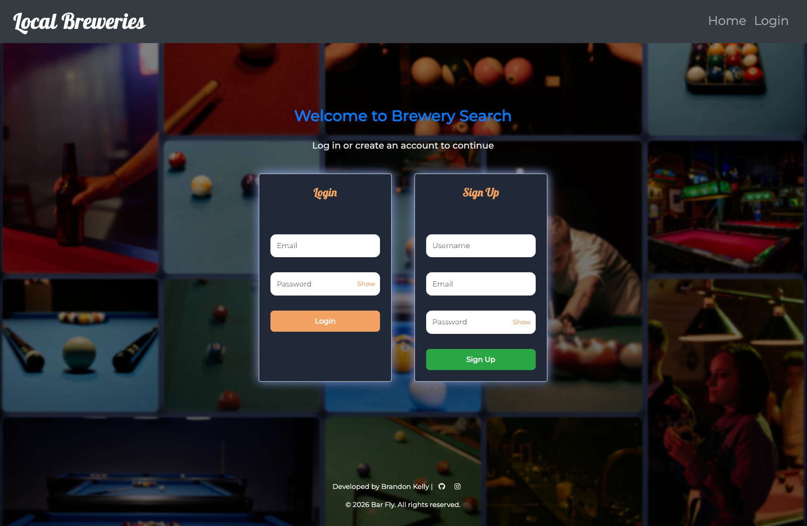
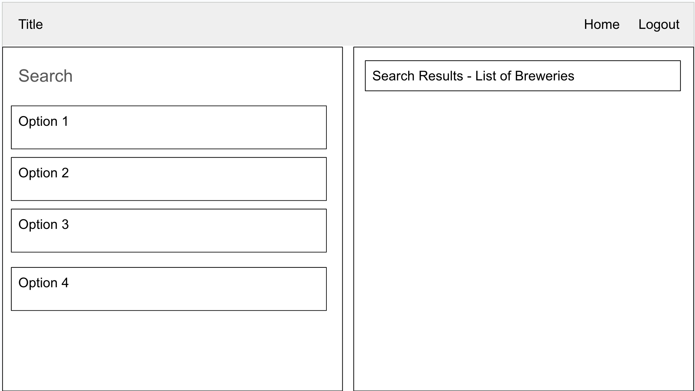
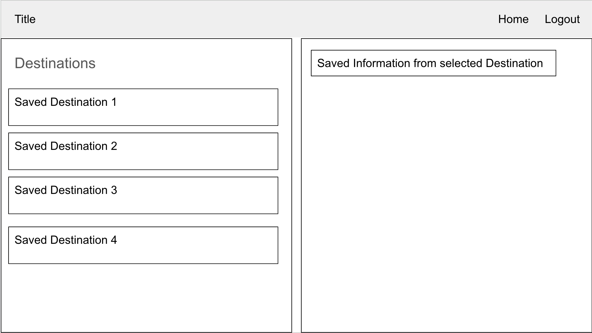

# Local Breweries

A responsive web app for discovering and saving breweries. Search by name, city, or state, view locations on a map, and maintain a personal list of saved breweries with optional comments.

## Features

- Search breweries by name, city, or state (Open Brewery DB)
- Save breweries to a private list (requires login)
- View locations with Leaflet maps
- Add comments to saved breweries
- Responsive UI with mobile-friendly search and navigation

## Screenshots

<p>
	
	
</p>
<!-- <p>
	
	
</p> -->

## Quick start

Prerequisites: Node.js (16+ recommended), npm

1. Install dependencies

```bash
npm install
```

2. Create a `.env` file (example keys)

```
SESSION_SECRET=your_secret_here
DATABASE_URL=./database.sqlite
```

3. Run the app

```bash
npm start       # start production server (node server.js)
# or, if configured for development:
npm run dev     # optional: nodemon + browser-sync workflow
```

The app serves on http://localhost:3001 by default (or the proxy port if using BrowserSync).

## Development notes

- Static assets live in `public/` and Handlebars views are under `views/`.
- The app uses Sequelize with SQLite by default; check `config/connection.js` and `seeds/` for seed data.
- For fast frontend feedback you can use a BrowserSync + nodemon dev workflow (not required).

## APIs & Data

- Brewery data source: Open Brewery DB — https://api.openbrewerydb.org

## Contributors & Credits

Contributors:

- [SJBDLT](https://github.com/SJBDLT)
- [Bkness](https://github.com/bkness)
- [Shawnclarke21](https://github.com/shawnclarke21)

Server/API integrations and assets by the contributors above.

Acknowledgements:
Coding BootCamp Curriculum — © 2022 edX Boot Camps LLC. All Rights Reserved.

## License

ISC

## Contact

- [Bkness](https://github.com/bkness) — kbrandon863@gmail.com

Deployed app: [Brewery Search](https://brewery-search.onrender.com/)
